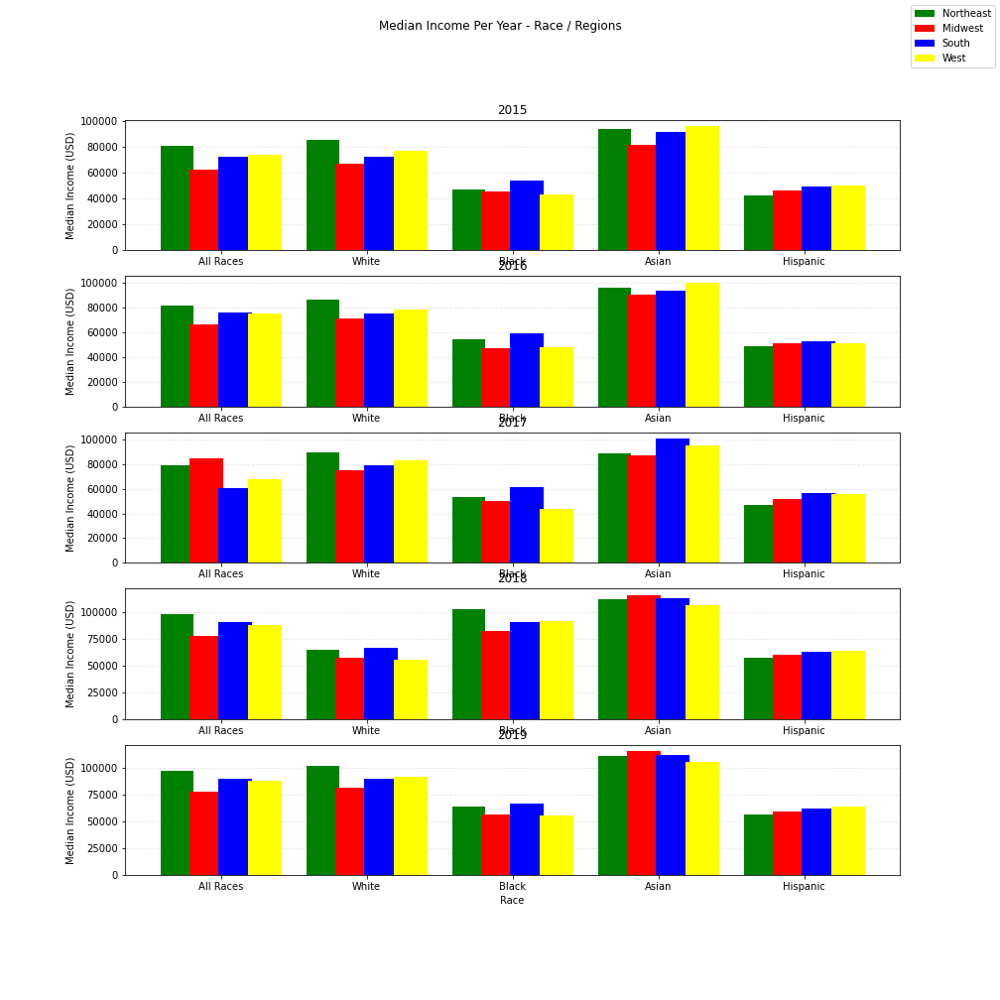
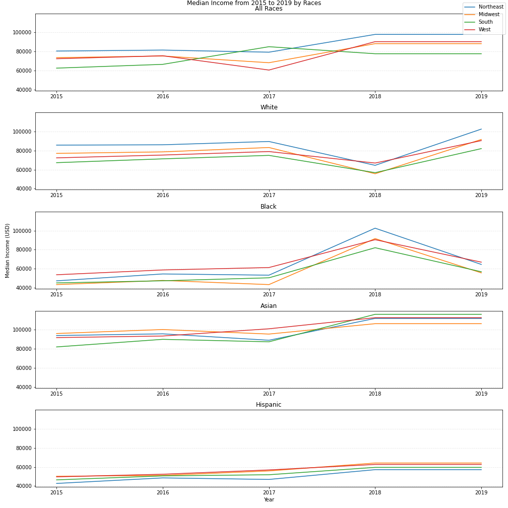
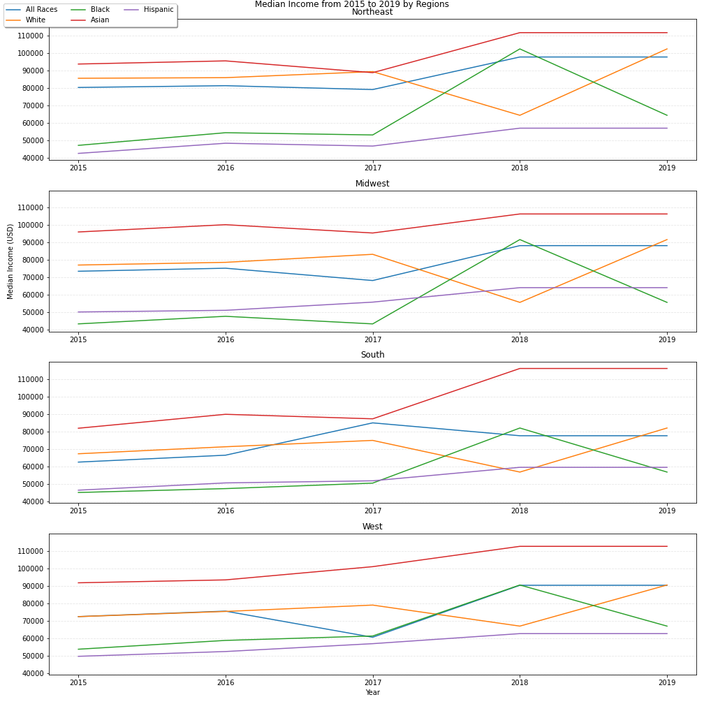
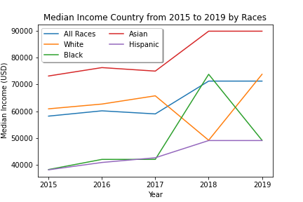
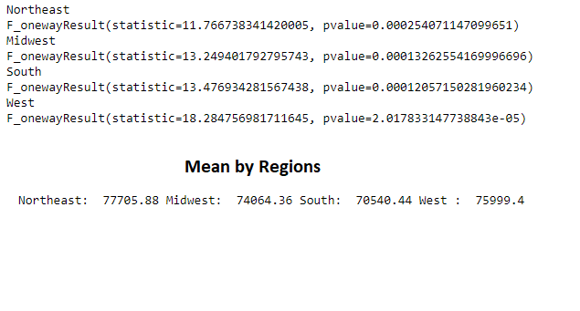

# UCF_Data_Bootcamp_Project1

# Question 4 :

## Is region also a factor that can affect income distribution among races?

This analysis examines income distribution among races in 4 regions in the United States (northeast midwest,south,west), using median income data from the U. S. census statistics for White, Black, Asian, and Hispanic families for the years 2015 - 2019, to try to respond thequestions about if region is also a factor that can affect income distribution among races.

For this analysis, the following graphs are made to study the behavior of the mean income values by region and by race.

The fist graph is a subplots of charts by year that shows the median income in each region by race in 5 years, and in this graph the region with greater median income is northeast for all the races, but it changes among races, this may be due to the population of each region.

The second graph is a line graph of subplots of charts by race that shows the median income values by region in 5 years. this graphs affirm the information obtanied for the first chart. Northeast is the region that have the greater median income for almost all the races.

The third graph shows a suplots of chart by Region showing the median income by races in five years. This chart shows that asian race have the greater median income in all the regions, so this can due to several factors like level education, asian population in the region, more companies hiring asian people, so this is a good point to investigate further.

This graphs shows a relevant increase in 2018 in relation to the black race and a significant decrease in the white race that in 2019 the trends are reversed in all the regions. This could be due to various factors such as the increase in the hiring of the black race, the fact that the black race has increased its level of education, it is really another study to analyze.
The Hispanic race has the lowest median income, but has positive trends.

The last graphs shows the median income of the races by country, In this graphics the same points of the third graph are observable. Asian race with the greater mnedian income. Import changes on 2018 and 2019 on all the races.
In 2018, Asian, black and hispanic with with a increase in median income and  white with a decrease in median income.
In 2019, Asian maintain their average income level, black with a decrease in median income, white and hispanic with a increase in median income.

Certainly there are regions with a median income value better than others, and these can affect the income values for each race.
The population of each race in each region can be a factor that have to take in consideration to get a better conclusion.

The stadictic values using annova by races are:

