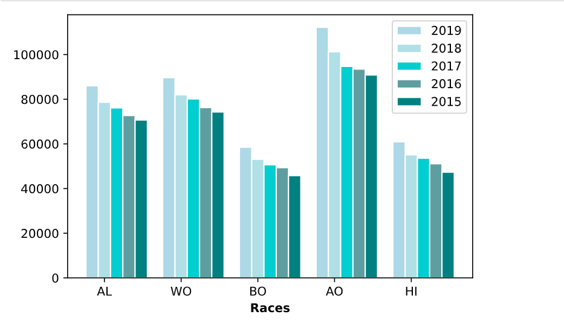
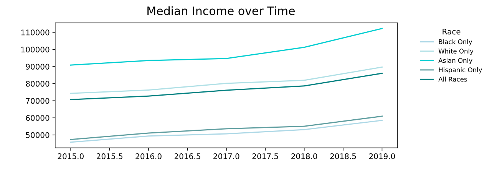

# UCF Data Analytics and Visualization Bootcamp
# Project 1 : Analysis of Income Inequality in The US

## Introduction

It is obvious income is not equally distributed among the U.S. population, as many studies in this area have found.  Even in times of economic boom, income inequality has increased significantly [[1]](https://www.nytimes.com/2003/01/23/business/economic-inequality-grew-in-90-s-boom-fed-reports.html).  Our project took upon the task of analyzing median-income data from the US Census years 2015 until 2019 and determine if the median income inequalities are statistically significant.  We analyzed median income distribution values by relating it to potential influential factors: race, marital status, region (location) and education attainment level. 

During our analysis, we asked our data the following questions:

* Is race diversity a statiscally significant factor in determining the median income in the United States? 

* How does marital status affect income distribution among races?

* Is the education level significant in determining the median income for a race group?

* Is region also a factor that can affect income distribution among races?

The approach we followed was to first create two chart plots for each question, using the [Matplotlib library](https://matplotlib.org/stable/index.html), then run hypothesis testing on the data to validate if the differences in median income are statistically significant. 
We assumed the median income data downloaded from the [Census website](https://www.census.gov/data/tables/time-series/demo/income-poverty/cps-finc/finc-01.html) is normally distributed, with equal variance. 

## Major Findings

### Question #1 : 

*Is income diversity between major ethnic groups in the US statistically significant?*

This analysis examines income distribution among races in the United States, using median income data from the U. S. census statistics for White, Black, Asian, and Hispanic families for the years 2015 - 2019. The analysis  first determines whether the income diversity among race groups is statistically significant. As indicated in the following graphs, there are imbalances among the race groups.

### Figure 1: Median Income By Race 2015-1029

(**AL=All Races**,  **WO=White Only**,   **BO=Black Only**,  **AO=Asian Only**,  **HI=Hispanic (All races)**)

### Figure 2 : Median Income Over Time

 To determine whether the differences are statistically significant, two test were performed. An ANOVA analysis and Kruskal-Wallis tests. The null hypothesis states that the means for the income of the four categories of races are equal. The Alternate hypothesis states that at least one of the four categories is significant different from others. The ANOVA resulted in a p<.05 leading to rejecting the null hypothesis. Since the data does not assume the population were equal amongst each racial group, a Kruskal-Wallis test was performed. As a result of the comparison, the differences among all pairs of races are statistically significant except the difference between Black Only and Hispanics Only Households.
