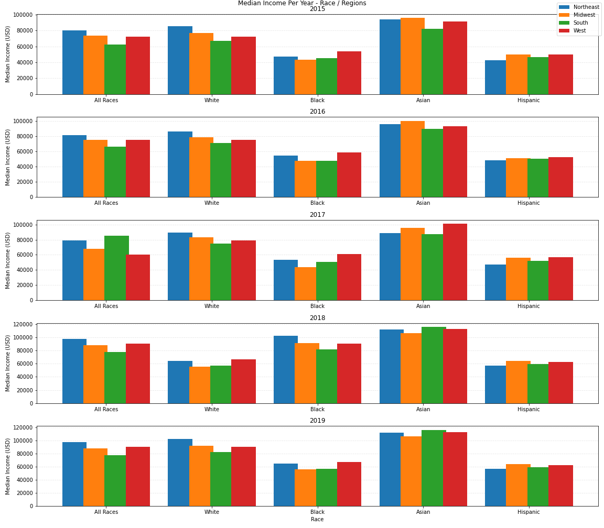

# UCF Data Analytics and Visualization Bootcamp
# Project 1 : Analysis of Income Inequality in The US

## Introduction

It is obvious income is not equally distributed among the U.S. population, as many studies in this area have found.  Even in times of economic boom, income inequality has increased significantly [[1]](https://www.nytimes.com/2003/01/23/business/economic-inequality-grew-in-90-s-boom-fed-reports.html).  Our project took upon the task of analyzing median-income data from the US Census years 2015 until 2019 and determine if the median income inequalities are statistically significant.  We analyzed median income distribution values by relating it to potential influential factors: race, marital status, region (location) and education attainment level. 

During our analysis, we asked our data the following questions:

* Is race diversity a statiscally significant factor in determining the median income in the United States? 

* How does marital status affect income distribution among races?

* Is the education level significant in determining the median income for a race group?

* Is region also a factor that can affect income distribution among races?

The approach we followed was to first create two chart plots for each question, using the [Matplotlib library](https://matplotlib.org/stable/index.html), then run hypothesis testing on the data to validate if the differences in median income are statistically significant. 
We assumed the median income data downloaded from the [Census website](https://www.census.gov/data/tables/time-series/demo/income-poverty/cps-finc/finc-01.html) is normally distributed, with equal variance. 

## Major Findings


### Question #1 : 

*Is income diversity between major ethnic groups in the US statistically significant?*

This analysis examines income distribution among races in the United States, using median income data from the U. S. census statistics for White, Black, Asian, and Hispanic families for the years 2015 - 2019. The analysis  first determines whether the income diversity among race groups is statistically significant. As indicated in the following graphs, there are imbalances among the race groups.

### Figure 1: Median Income By Race 2015-1029


(**AL=All Races**,  **WO=White Only**,   **BO=Black Only**,  **AO=Asian Only**,  **HI=Hispanic (All races)**)

### Figure 2 : Median Income Over Time


 To determine whether the differences are statistically significant, two test were performed. An ANOVA analysis and Kruskal-Wallis tests. The null hypothesis states that the means for the income of the four categories of races are equal. The Alternate hypothesis states that at least one of the four categories is significant different from others. The ANOVA resulted in a p<.05 leading to rejecting the null hypothesis. Since the data does not assume the population were equal amongst each racial group, a Kruskal-Wallis test was performed. As a result of the comparison, the differences among all pairs of races are statistically significant except the difference between Black Only and Hispanics Only Households.
 
 
 
 
 
 
 ### Question #2 : 

*Is marital status a significant factor in the median income of households?*

Here we examine the median income of married households vs that of unmarried households (single female or single male as head of household).  We found married households display a higher median income than unmarried ones, for all ethnic groups. The mean values by race also follow the findings in the previous question, where the Asian-Only group has the highest income, while Black-Only and Hispanic have the lowest. 

#### Figure 3: Median Income for Married vs Single Households 2015-2019


For hypothesis testing, our hypothesis were:


The null hypothesis states that for both groups (married and unmarried), the median income is the same.  The alternate hypothesis says there is a statistically significant difference in the median incomes between married and unmarried groups. 

We tested the hypothesis using a independent t-test.  Using the Pandas library, we created a data frame with the following data frame (`line_plot_df`):

| Year | Race | Married Median Income | Unmarried Median Income | 
|------|------|-----------------------|-------------------------|

And executed the t-test using the following code, using the ttest_ind() call from the scipy module.

```
population1 = line_plot_df["Unmarried"]
population2 = line_plot_df["Married"]
stats.ttest_ind(population1, population2, equal_var=False)
```
The results were:

`Ttest_indResult(statistic=-9.879841269215676, pvalue=1.965136854688217e-12)`

Since the *p* value is much smaller than 0.05 we can confidently reject the null hypothesis and say that the income difference is statistically significant.


### Question #3 : 

*Is the education level significant in determining the median income for a race group?*


Our data study finds that the comparable education levels did not appear to bare weight on median income by race. In analysis for comparable educational levels, the Asian race consistently earned the most median income while the Black/African-American race consistently earned the least. This remained true for White and Hispanic consistently being 2nd and 3rd most, respectively.

#### Figure 4: Median Income vs. Achieved Level of Education


#### Figure 5: Median Income vs Race and Achieved Level of Education


### Question #4 : 
# Question 4 :

## Is region also a factor that can affect income distribution among races?

This analysis examines income distribution among races in 4 regions in the United States (northeast midwest,south,west), using median income data from the U. S. census statistics for White, Black, Asian, and Hispanic families for the years 2015 - 2019, to try to respond thequestions about if region is also a factor that can affect income distribution among races.

For this analysis, the following graphs are made to study the behavior of the mean income values by region and by race.

The fist graph is a subplots of charts by year that shows the median income in each region by race in 5 years, and in this graph the region with greater median income is northeast for all the races, but it changes among races, this may be due to the population of each region.



The second graph is a line graph of subplots of charts by race that shows the median income values by region in 5 years. this graphs affirm the information obtanied for the first chart. Northeast is the region that have the greater median income for almost all the races.


The third graph shows a suplots of chart by Region showing the median income by races in five years. This chart shows that asian race have the greater median income in all the regions, so this can due to several factors like level education, asian population in the region, more companies hiring asian people, so this is a good point to investigate further.


This graphs shows a relevant increase in 2018 in relation to the black race and a significant decrease in the white race that in 2019 the trends are reversed in all the regions. This could be due to various factors such as the increase in the hiring of the black race, the fact that the black race has increased its level of education, it is really another study to analyze.
The Hispanic race has the lowest median income, but has positive trends.

The last graphs shows the median income of the races by country, In this graphics the same points of the third graph are observable. Asian race with the greater mnedian income. Import changes on 2018 and 2019 on all the races.
In 2018, Asian, black and hispanic with with a increase in median income and  white with a decrease in median income.
In 2019, Asian maintain their average income level, black with a decrease in median income, white and hispanic with a increase in median income.


Certainly there are regions with a median income value better than others, and these can affect the income values for each race.
The population of each race in each region can be a factor that have to take in consideration to get a better conclusion.

The stadictic values using annova by races are:


## Implications

* Income disparity across ethnic groups is statistically significant . 

* On average, married households show a higher income.  But this does not mean causation.  Other conditions should be considered.  For example, married households could have dual incomes, thus the higher values.  They also have the ability to share more economic risks, with higher rewards. 

* The Asian and White races have a higher amount of income in comparable levels of  educational attainment whereas the Black and Hispanic community consistently lag behind

* Regions can make a difference in the median income, but we cannot affirm the same for races since it is necessary to study the population in each region.

